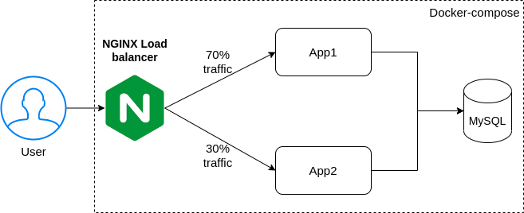

# 🧬 Docker story

## 🔰 Milestones
- [X] Container: Namespaces + Cgroups
- [X] Container Runtime:
    - Low-level container Runtime: runc
    - High-level container Runtime: containerd
- [X] Docker
- [X] Docker-Compose

## 📋 Requirements
* Ubuntu 16.04+
* Docker
* Docker-compose
* sudo apt-get install cgroup-tools

## 📘 Pipeline

### Create Namespaces with `unshare`
`
bash namespace.sh
`

### Create Cgroups with `cgcreate`
`
bash cgroups.sh
`

### Create Container with Namespace + Cgroups
`
bash create_container_ns_cgroups.sh
`

### Create Container with Low-level container runtime: runc
`
bash create_container_runc.sh
`

### Usage High-level container runtime: containerd
`
bash containerd.sh
`

### Docker build + deploy: Link test: locahost:8080
`
bash run_docker.sh
`

### Docker-compose

  

locahost:8080 - test loadbalancer service

locahost:8080/db - test connect MySQL

`
cd docker-compose-demo
`

`
docker-compose up
`